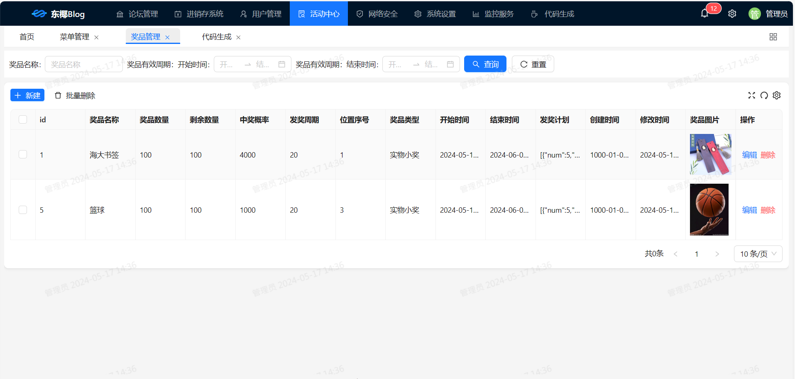
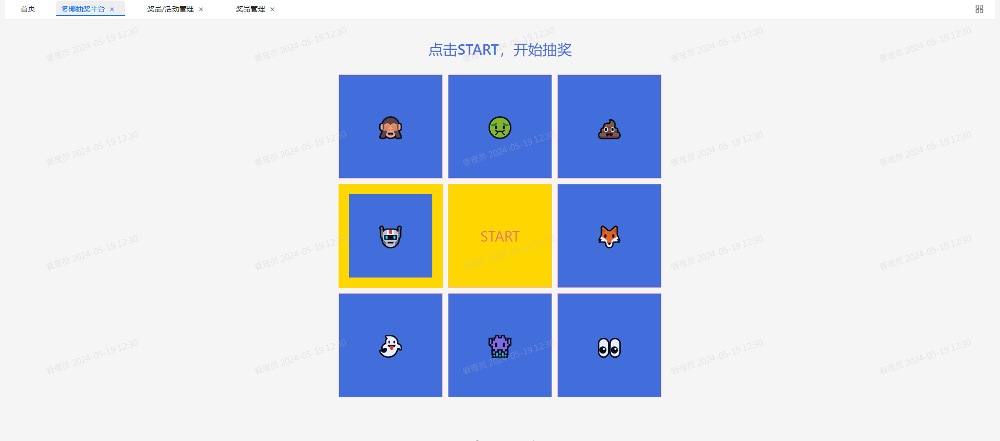
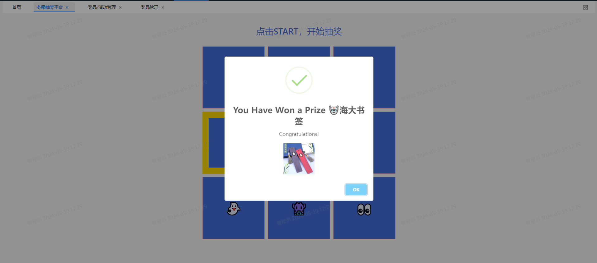
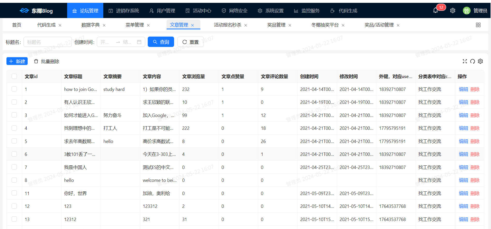
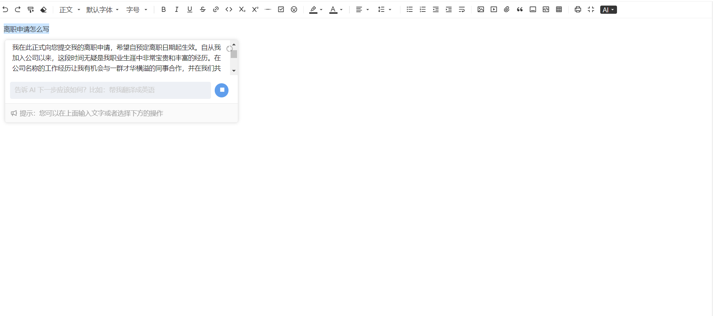

东椰社区平台
如果该程序对你有帮助😎😎😎，希望给个⭐star⭐喔。😘😘😘😍🥰🎉🎈🎃

计划开发的功能：博客+大学活动报名秒杀+抽奖平台
抽奖平台功能: 用户可以发起抽奖活动，设置抽奖规则，设置奖品，设置抽奖计划，黑名单。
活动秒杀功能: 管理员发起活动，设置活动截至时间，设置活动奖品（抽奖次数），设置活动人数限制。
社区板块功能: 发帖，点赞，全文搜索，评论，点赞排行榜，个人主页。
八股文助手功能: 通过阿里通义千问的知识库构建功能，构建自己的八股文知识库，提供生成式ai功能。

技术栈

前端
Ant Design Vue：一个基于 Vue 的 UI 组件库。
aiEditor：一键引入ai编辑器。支持科大讯飞星火模型。

后端

Spring Cloud Alibaba：致力于提供微服务开发的一站式解决方案。

Sentinel：把流量作为切入点，从流量控制、熔断降级、系统负载保护等多个维度保护服务的稳定性。

Nacos：一个更易于构建云原生应用的动态服务发现、配置管理和服务管理平台。

MyBatis-Plus：MyBatis的增强版。

Redission：基于Java的缓存系统封装，提供统一的API和注解来简化缓存的使用。

ElasticSearch+Easy-es：分布式搜索引擎+傻瓜式api操作。

kafka：分布式流处理平台。

库主的个人博客: niit.skylm.cn
目前实现的功能
奖品管理

抽奖页面

文章管理

引入科大讯飞的大模型进行ai续写
